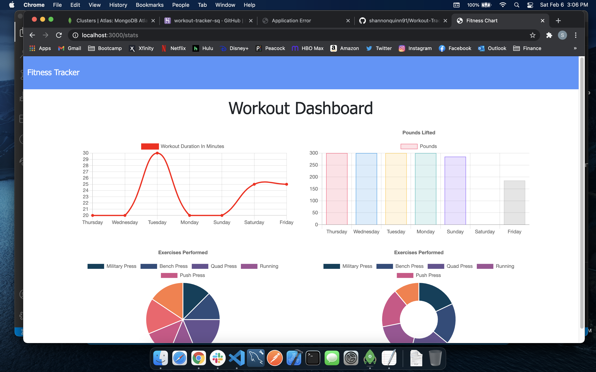

# Fitness Tracker & Dashboard
  ## Table of Contents
 
  - [Links](#links)
  - [Description](#description)
  - [Installation](#installation)
  - [Contact Me](#contact-me)
  - [Screenshots](#screenshots)

  ## Links
  Github Repo: https://github.com/shannonquinn91/Workout-Tracker  
  Deployed Application: 

  ## Description
  The fitness tracker allows the user to enter specific information about the exercises they are performing. The dashboard shows the user data on the last seven workouts recorded, such as total duration, and a pie chart of exercises.    
  

  ## Installation
  A user can install the necessary node packages using the following command:
  ```
  npm install
  ```
  ## Contact Me
  You can check out my GitHub profile at https://www.github.com/shannonquinn91 or email me at shannon.quinn91@gmail.com.
  ## Screenshots
    
  